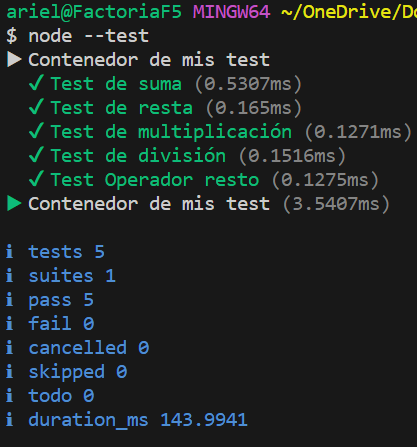

# Proyecto de Testing con Node.js y test-runner

Este es un proyecto de ejemplo que demuestra cómo realizar pruebas unitarias en Node.js utilizando el módulo de testing test-runner incorporado en el paquete de Node.

# Descripción del Proyecto

En este proyecto, hemos creado pruebas unitarias para diversas funciones matemáticas simples, incluyendo suma, resta, multiplicación, división y el operador módulo. El objetivo es asegurarnos de que estas funciones produzcan los resultados esperados y manejen adecuadamente diferentes situaciones.

# Requisitos Previos

Node.js: Asegúrate de tener Node.js instalado en tu sistema. Puedes descargarlo desde nodejs.org.

# Generamos el ambiente de desarrollo

1-Creamos el archivo index.js donde estaran las a las cuales les realizare el testing.
2-Creamos el archivo index.test.js donde realizaremos nuestros test, en este archivo tenga en cuenta que es muy importante la importación de import assert from "node:assert/strict";
import { describe, it } from "node:test" en este ultimo caso puede variar según tus necesidades ta,mbien puedes usar test en vez de describe y it pero en el caso de que uses test tienes que importar:import test from "node:test".
3-Creamos nuestro archivo package.json en el cual solo ponemos solo "type":"module"

# Uso

1-Solo para correr los test necesitamos insertar este comando en la terminal node --test 
nota:Muy importante tener node instalado de manera global.

# Contacto

Si tienes alguna pregunta o sugerencia sobre este proyecto, no dudes en contactarme en,
email:arielaparicio100@gmail.com
github:https://github.com/Arielparicio28/Test-runner

¡Gracias por utilizar este proyecto de ejemplo para realizar pruebas unitarias en Node.js! Si tienes alguna pregunta adicional o necesitas más ayuda, no dudes en preguntar.